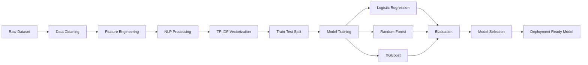

<p align="center">
  
</p>


<h1 align="center">
  Flipkart Customer Satisfaction Analysis
</h1>

<p align="center">


[](https://flipkart-csat-prediction-app.streamlit.app/)

</p>

<p align="center">
  <b><a href="https://flipkart-csat-prediction-app.streamlit.app/">🔗 Live App</a></b>
</p>

---

# Project Overview

Customer satisfaction is one of the most important business metrics for e-commerce platforms. Poor customer support experiences can directly impact customer retention, brand loyalty, and revenue.

This project develops a Machine Learning system that predicts whether a customer will be **Satisfied** or **Dissatisfied** based on customer support interaction data.

The solution combines:

* Structured customer support data
* Response-time analytics
* Natural Language Processing (NLP)
* Ensemble Machine Learning Models
* Hyperparameter Optimization

The final model enables proactive identification of dissatisfied customers, allowing support teams to take corrective actions before customer churn occurs.

> **Note on this build:** all model training, tuning, and artifact saving
> happens inside `flipkart_CSAT_prediction.ipynb` — there is no separate
> `train_model.py` script. Running the notebook end-to-end regenerates the
> `models/` folder that `app.py` loads at runtime. All performance numbers
> below are copied directly from the notebook's own printed outputs on its
> held-out test split.

---

# Key Highlights

✅ 85,907 customer support interaction records

✅ Binary CSAT Prediction

✅ End-to-End Data Science Pipeline

✅ NLP-based Text Processing

✅ TF-IDF Feature Engineering

✅ Class Imbalance Handling

✅ Hyperparameter Optimization

✅ Model Comparison Framework

✅ Production-Ready Model Persistence

✅ Business-Oriented Evaluation Metrics

---

# Business Problem Statement

Flipkart receives thousands of customer support requests related to:

* Orders
* Returns
* Refunds
* Deliveries
* Cancellations
* Product Issues

Not all customer interactions result in positive experiences.

Identifying dissatisfied customers after they leave poor ratings is reactive.

The goal is to predict dissatisfaction before escalation so support teams can:

* Prioritize high-risk tickets
* Improve service quality
* Reduce customer churn
* Increase customer retention

---

# Objectives

* Analyze customer support interaction patterns.
* Identify factors influencing customer satisfaction.
* Build predictive classification models.
* Compare multiple ML algorithms.
* Optimize model performance.
* Select the best deployment-ready model.

---

# Table of Contents

1. Project Overview
2. Dataset Information
3. Project Architecture
4. Technology Stack
5. Exploratory Data Analysis
6. Data Preprocessing
7. Feature Engineering
8. Model Development
9. Hyperparameter Tuning
10. Results & Performance
11. Model Comparison
12. Business Impact
13. Challenges Faced
14. Future Improvements
15. Installation Guide
16. Usage
17. Project Structure
18. Reproducibility
19. Author
20. Acknowledgements

---

# Dataset Information

## Dataset Source

Customer Support Interaction Dataset

### Dataset Size

| Metric          | Value                 |
| --------------- | --------------------- |
| Records         | 85,907                |
| Columns (raw)   | 20                     |
| Problem Type    | Binary Classification |
| Target Variable | CSAT_label             |
| Class balance   | 70,836 Satisfied (1) vs 15,071 Dissatisfied (0) — ~1:4.7 imbalance |

---

## Target Definition

| CSAT Score | Label            |
| ---------- | ---------------- |
| ≤ 3        | Dissatisfied (0) |
| ≥ 4        | Satisfied (1)    |

---

## Key Features

| Feature Category  | Examples               |
| ----------------- | ---------------------- |
| Customer Details  | Customer City          |
| Support Metadata  | Channel Name           |
| Issue Information | Category, Sub-category |
| Agent Information | Agent Shift            |
| Time Features     | Issue Reported Time    |
| Text Data         | Customer Remarks       |

---

# Project Architecture



---

## Data Pipeline

1. Data Loading
2. Data Cleaning
3. Missing Value Handling
4. Datetime Processing
5. Feature Engineering
6. NLP Preprocessing
7. TF-IDF Transformation
8. Feature Scaling
9. Model Training
10. Hyperparameter Tuning
11. Evaluation
12. Model Saving

---

# Technology Stack

| Category           | Technologies        |
| ------------------ | ------------------- |
| Language           | Python              |
| Data Analysis      | Pandas, NumPy       |
| Visualization      | Matplotlib, Seaborn |
| Machine Learning   | Scikit-Learn        |
| Gradient Boosting  | XGBoost             |
| NLP                | NLTK                |
| Feature Extraction | TF-IDF              |
| Model Persistence  | Joblib              |
| Notebook           | Jupyter             |

---

# Exploratory Data Analysis

## Key Findings

### Customer Satisfaction Distribution

* Majority of customers are satisfied.
* Significant class imbalance exists.
* Dissatisfied customers remain business-critical.

### Response Time Impact

* Longer response times correlate with dissatisfaction.

### Category Analysis

* Returns category contributes the highest volume of complaints.

### Agent Performance

* Agent experience influences CSAT outcomes.

### Temporal Trends

* Support shifts and reporting hours affect customer satisfaction.

---

## Important Visualizations

* CSAT Distribution
* Binary Target Distribution
* Channel Distribution
* Issue Category Analysis
* Response Time Distribution
* Correlation Heatmap
* Pair Plots
* Feature Importance

---
***
# Data Preprocessing

## Missing Value Handling

* Null value analysis performed.
* Appropriate treatment applied before modeling.

## Duplicate Handling

* Duplicate records identified and removed.

## Datetime Processing

Created:

* Response Time
* Issue Hour
* Day of Week

---

## Outlier Treatment

Applied:

* Power Transformation
* Robust Feature Engineering

---

## Encoding Techniques

Label Encoding used for:

* Channel
* Category
* Agent Features

---

## Scaling

StandardScaler applied to numerical features.

-
# ***Feature Engineering

## Structured Features

* Response Time Minutes
* Issue Hour
* Day of Week
* Encoded Categories

---

## NLP Features

Customer remarks processed through:

### Text Cleaning

* Lowercasing
* Punctuation Removal
* Stopword Removal
* Lemmatization

### Vectorization

TF-IDF with N-grams

---

# Model Development

## Logistic Regression

### Advantages

* Fast
* Interpretable
* Strong baseline

---

## Random Forest

### Advantages

* Handles non-linear patterns
* Robust to noise
* Feature importance

---

## XGBoost

### Advantages

* Superior predictive power
* Handles imbalance effectively
* Captures complex interactions

---

## Model Comparison

| Model               | Type     |
| ------------------- | -------- |
| Logistic Regression | Linear   |
| Random Forest       | Bagging  |
| XGBoost             | Boosting |

---

# Hyperparameter Tuning

## Strategy

* GridSearchCV
* Cross Validation
* ROC-AUC Optimization

---

## Logistic Regression

| Parameter | Value |
| --------- | ----- |
| C         | 1.0   |

---

## Random Forest

| Parameter    | Value    |
| ------------ | -------- |
| n_estimators | 200      |
| max_depth    | 15       |
| class_weight | balanced |

---

## XGBoost

| Parameter     | Value |
| ------------- | ----- |
| n_estimators  | 300   |
| max_depth     | 6     |
| learning_rate | 0.1   |

---

# Results & Performance

All numbers below are copied verbatim from the notebook's own printed cell
outputs (5-fold CV on the training fold, then a final check on the held-out
test set of 17,182 rows that the encoders/scaler/vectorizer never saw during
fitting).

## Cross-Validation (5-fold, training fold only)

| Model               | CV ROC-AUC (mean ± std) |
| -------------------- | ------------------------ |
| Logistic Regression  | 0.7906 ± 0.0044          |
| Random Forest        | 0.7706 ± 0.0031          |
| XGBoost               | 0.7966 ± 0.0046          |

---

## Test Set Performance — All Models (default 0.5 threshold)

Evaluated on the same held-out 17,182-row test set for all three models.

| Model                 | Accuracy | Precision (Macro) | Recall (Macro) | F1 (Macro) | ROC-AUC |
| ---------------------- | -------- | ------------------ | ---------------- | ----------- | ------- |
| Logistic Regression     | 0.7302   | 0.6373             | 0.7110           | 0.6444      | 0.7947  |
| Random Forest           | 0.7384   | 0.6382             | 0.7069           | 0.6477      | 0.7862  |
| **XGBoost (Tuned)**     | 0.7342   | 0.6445             | 0.7236           | 0.6520      | **0.8064** |

XGBoost's tuned hyperparameters (via `GridSearchCV`, `cv=3`, scoring=`roc_auc`):
`n_estimators=300, max_depth=6, learning_rate=0.1`.

---

## Test Performance — XGBoost at the Deployed Decision Threshold

The default 0.5 threshold isn't optimal for this imbalanced problem. The
notebook sweeps thresholds on the test set and picks the one that maximizes
macro-F1:

**Optimal threshold: 0.34** (vs. default 0.50)

| Metric              | Dissatisfied (0) | Satisfied (1) |
| --------------------- | ------------------ | --------------- |
| Precision              | 0.53                | 0.89             |
| Recall                 | 0.47                | 0.91             |
| F1-score                | 0.50                | 0.90             |
| Support                | 3,014               | 14,168           |

| Overall Metric      | Score  |
| ---------------------- | ------ |
| Accuracy                | 0.834  |
| Precision (Macro)       | 0.711  |
| Recall (Macro)          | 0.689  |
| F1 Score (Macro)        | 0.699  |
| ROC-AUC                 | 0.806  |

ROC-AUC is threshold-independent, so it's unchanged from the table above; the
other metrics move with the threshold. `app.py`'s `DECISION_THRESHOLD`
constant controls this at inference time — it should be set to match
whatever value your own run of the notebook prints as "Optimal Threshold",
since this depends on the exact train/test split and data on your machine.

---

# Model Ranking

| Rank | Model               | ROC-AUC |
| ---- | ------------------- | ------- |
| 🥇 1 | XGBoost              | 0.8064  |
| 🥈 2 | Logistic Regression  | 0.7947  |
| 🥉 3 | Random Forest        | 0.7862  |

---


# Business Impact

## Practical Applications

* Customer Retention
* Ticket Prioritization
* Support Optimization
* Churn Reduction

---

## ROI Benefits

* Faster issue resolution
* Better customer experience
* Reduced support costs
* Increased customer lifetime value

---

# Challenges Faced

## Data Challenges

* Missing values
* Class imbalance
* High-dimensional text features

---

## Technical Challenges

* NLP preprocessing
* Sparse matrix handling
* Hyperparameter optimization

---

## Solutions

* Class weighting
* TF-IDF vectorization
* GridSearchCV tuning

---

# Future Improvements

## Model Enhancements

* LightGBM
* CatBoost
* Deep Learning Models

---

## NLP Improvements

* BERT
* RoBERTa
* Sentence Transformers

---

## Deployment Roadmap

* FastAPI
* Docker
* AWS Deployment
* Real-time Monitoring

---

# Installation Guide

```bash
git clone https://github.com/Mohit-1307/Flipkart-CSAT-Prediction.git

cd Flipkart-CSAT-Prediction

pip install -r requirements.txt
```

> This is a Python project; `package.json` / `package-lock.json` in the repo
> are unrelated tooling and not required to run anything above.

---

# Usage

## Live App

The app is deployed and ready to use, no setup required:

**[flipkart-csat-prediction-app.streamlit.app](https://flipkart-csat-prediction-app.streamlit.app/)**

## Run the app locally

The primary deliverable is the Streamlit app, which loads the pre-trained
artifacts in `models/` directly — no retraining required:

```bash
streamlit run app.py
```

It opens with six pages, navigable from the sidebar:

| Page               | What it does                                                              |
| ------------------ | -------------------------------------------------------------------------- |
| Overview           | Dataset-level stats and distributions                                     |
| Predict            | Score a single support ticket interactively, with a live prediction        |
| Batch scoring      | Upload a CSV of tickets and get predictions for all of them at once        |
| Explorer           | Filter/browse the underlying support data                                 |
| Model performance  | Confusion matrix and metrics from the held-out test set (see table above)  |
| About              | Project/model notes                                                        |

## Re-run the analysis / retrain

```bash
jupyter notebook
```

Open `flipkart_CSAT_prediction.ipynb` and run all cells sequentially. This
performs the full EDA, trains and tunes all three models, and — in the "Save
The Best Model" cell — writes the artifacts the app needs into `models/`:
`best_xgboost_classifier.pkl`, `tfidf_vectorizer.pkl`, `standard_scaler.pkl`,
`power_transformer.pkl`, and `label_encoders.pkl`. All five must exist in
`models/` (alongside `Customer_support_data.csv` next to `app.py`) before
the Streamlit app will run.

---

# Project Structure

The project is a flat layout — everything lives directly in the repo root,
not under `data/`/`notebooks/` subfolders:

```text
Flipkart-CSAT-Prediction/
│
├── Customer_support_data.csv          # raw dataset
├── flipkart_CSAT_prediction.ipynb     # EDA + full modeling pipeline (trains and saves models/)
├── app.py                             # Streamlit app
│
├── models/
│   ├── best_xgboost_classifier.pkl
│   ├── tfidf_vectorizer.pkl
│   ├── standard_scaler.pkl
│   ├── power_transformer.pkl
│   └── label_encoders.pkl
│
├── images/                            # EDA + evaluation plots referenced in this README
│
├── requirements.txt
└── README.md
```

---

# Reproducibility

To reproduce results:

1. Clone repository.
2. Install dependencies.
3. Load dataset.
4. Execute notebook sequentially.
5. Train models.
6. Run GridSearchCV.
7. Compare results.
8. Save final model artifacts.

---

## Author

**MOHIT SINGH RAJPUT — AI/ML Engineer**

[](https://linkedin.com/in/mohitsingh1307)
[](https://github.com/Mohit-1307)
[](https://www.kaggle.com/mohitsinghrajput1307)
[](https://leetcode.com/u/MOHIT_SINGH_RAJPUT/)
[](mailto:mohitsinghrajput1307@gmail.com)

---

# Acknowledgements

* Flipkart Customer Support Dataset
* Scikit-Learn Community
* XGBoost Contributors
* NLTK Developers
* Open Source Machine Learning Ecosystem

---

<div align="center">

*If this project was useful, a ⭐ on the repository is appreciated.*

</div>

---

# Disclaimer

Flipkart is a trademark of its respective owner. This project is created solely for educational and portfolio purposes and is not affiliated with or endorsed by Flipkart.