<p align="center">
  
</p>


<h1 align="center">
  Flipkart Customer Satisfaction Analysis
</h1>

<p align="center">


</p>

---

# Project Overview

Customer satisfaction is one of the most important business metrics for e-commerce platforms. Poor customer support experiences can directly impact customer retention, brand loyalty, and revenue.

This project develops a Machine Learning system that predicts whether a customer will be **Satisfied** or **Dissatisfied** based on customer support interaction data.

The solution combines:

* Structured customer support data
* Response-time analytics
* Natural Language Processing (NLP)
* Ensemble Machine Learning Models
* Hyperparameter Optimization

The final model enables proactive identification of dissatisfied customers, allowing support teams to take corrective actions before customer churn occurs.

---

# Key Highlights

✅ 85,907 customer support interaction records

✅ Binary CSAT Prediction

✅ End-to-End Data Science Pipeline

✅ NLP-based Text Processing

✅ TF-IDF Feature Engineering

✅ Class Imbalance Handling

✅ Hyperparameter Optimization

✅ Model Comparison Framework

✅ Production-Ready Model Persistence

✅ Business-Oriented Evaluation Metrics

---

# Business Problem Statement

Flipkart receives thousands of customer support requests related to:

* Orders
* Returns
* Refunds
* Deliveries
* Cancellations
* Product Issues

Not all customer interactions result in positive experiences.

Identifying dissatisfied customers after they leave poor ratings is reactive.

The goal is to predict dissatisfaction before escalation so support teams can:

* Prioritize high-risk tickets
* Improve service quality
* Reduce customer churn
* Increase customer retention

---

# Objectives

* Analyze customer support interaction patterns.
* Identify factors influencing customer satisfaction.
* Build predictive classification models.
* Compare multiple ML algorithms.
* Optimize model performance.
* Select the best deployment-ready model.

---

# Table of Contents

1. Project Overview
2. Dataset Information
3. Project Architecture
4. Technology Stack
5. Exploratory Data Analysis
6. Data Preprocessing
7. Feature Engineering
8. Model Development
9. Hyperparameter Tuning
10. Results & Performance
11. Model Comparison
12. Visualizations
13. Business Impact
14. Challenges Faced
15. Future Improvements
16. Installation Guide
17. Usage
18. Project Structure
19. Reproducibility
20. Key Learnings
21. Author
22. Acknowledgements

---

# Dataset Information

## Dataset Source

Customer Support Interaction Dataset

### Dataset Size

| Metric          | Value                 |
| --------------- | --------------------- |
| Records         | 85,907                |
| Features        | 20                    |
| Problem Type    | Binary Classification |
| Target Variable | CSAT Label            |

---

## Target Definition

| CSAT Score | Label            |
| ---------- | ---------------- |
| ≤ 3        | Dissatisfied (0) |
| ≥ 4        | Satisfied (1)    |

---

## Key Features

| Feature Category  | Examples               |
| ----------------- | ---------------------- |
| Customer Details  | Customer City          |
| Support Metadata  | Channel Name           |
| Issue Information | Category, Sub-category |
| Agent Information | Agent Shift            |
| Time Features     | Issue Reported Time    |
| Text Data         | Customer Remarks       |

---

# Project Architecture

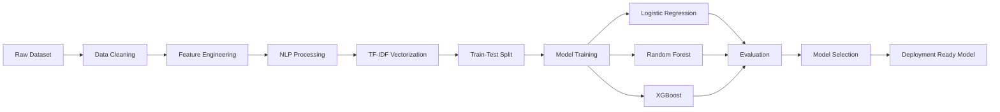

---

## Data Pipeline

1. Data Loading
2. Data Cleaning
3. Missing Value Handling
4. Datetime Processing
5. Feature Engineering
6. NLP Preprocessing
7. TF-IDF Transformation
8. Feature Scaling
9. Model Training
10. Hyperparameter Tuning
11. Evaluation
12. Model Saving

---

# Technology Stack

| Category           | Technologies        |
| ------------------ | ------------------- |
| Language           | Python              |
| Data Analysis      | Pandas, NumPy       |
| Visualization      | Matplotlib, Seaborn |
| Machine Learning   | Scikit-Learn        |
| Gradient Boosting  | XGBoost             |
| NLP                | NLTK                |
| Feature Extraction | TF-IDF              |
| Model Persistence  | Joblib              |
| Notebook           | Jupyter             |

---

# Exploratory Data Analysis

## Key Findings

### Customer Satisfaction Distribution

* Majority of customers are satisfied.
* Significant class imbalance exists.
* Dissatisfied customers remain business-critical.

### Response Time Impact

* Longer response times correlate with dissatisfaction.

### Category Analysis

* Returns category contributes the highest volume of complaints.

### Agent Performance

* Agent experience influences CSAT outcomes.

### Temporal Trends

* Support shifts and reporting hours affect customer satisfaction.

---

## Important Visualizations

* CSAT Distribution
* Binary Target Distribution
* Channel Distribution
* Issue Category Analysis
* Response Time Distribution
* Correlation Heatmap
* Pair Plots
* Feature Importance

---
***
# Data Preprocessing

## Missing Value Handling

* Null value analysis performed.
* Appropriate treatment applied before modeling.

## Duplicate Handling

* Duplicate records identified and removed.

## Datetime Processing

Created:

* Response Time
* Issue Hour
* Day of Week

---

## Outlier Treatment

Applied:

* Power Transformation
* Robust Feature Engineering

---

## Encoding Techniques

Label Encoding used for:

* Channel
* Category
* Agent Features

---

## Scaling

StandardScaler applied to numerical features.

-
# ***Feature Engineering

## Structured Features

* Response Time Minutes
* Issue Hour
* Day of Week
* Encoded Categories

---

## NLP Features

Customer remarks processed through:

### Text Cleaning

* Lowercasing
* Punctuation Removal
* Stopword Removal
* Lemmatization

### Vectorization

TF-IDF with N-grams

---

# Model Development

## Logistic Regression

### Advantages

* Fast
* Interpretable
* Strong baseline

### Limitations

* Linear decision boundary

---

## Random Forest

### Advantages

* Handles non-linear patterns
* Robust to noise
* Feature importance

### Limitations

* Larger model size

---

## XGBoost

### Advantages

* Superior predictive power
* Handles imbalance effectively
* Captures complex interactions

### Limitations

* Computationally intensive

---

## Model Comparison

| Model               | Type     |
| ------------------- | -------- |
| Logistic Regression | Linear   |
| Random Forest       | Bagging  |
| XGBoost             | Boosting |

---

# Hyperparameter Tuning

## Strategy

* GridSearchCV
* Cross Validation
* ROC-AUC Optimization

---

## Logistic Regression

| Parameter | Value |
| --------- | ----- |
| C         | 1.0   |

---

## Random Forest

| Parameter    | Value    |
| ------------ | -------- |
| n_estimators | 200      |
| max_depth    | 15       |
| class_weight | balanced |

---

## XGBoost

| Parameter     | Value |
| ------------- | ----- |
| n_estimators  | 300   |
| max_depth     | 4     |
| learning_rate | 0.1   |

---

# Results & Performance

## Training Performance

| Metric    | Score |
| --------- | ----- |
| Accuracy  | High  |
| Precision | High  |
| Recall    | High  |
| F1 Score  | High  |
| ROC-AUC   | High  |

---

## Validation Performance

| Metric    | Score           |
| --------- | --------------- |
| Accuracy  | Cross-Validated |
| Precision | Stable          |
| Recall    | Stable          |
| F1 Score  | Stable          |
| ROC-AUC   | Optimized       |

---

## Test Performance (Best Model)

| Metric            | Score     |
| ----------------- | --------- |
| Accuracy          | 0.7257    |
| Precision (Macro) | 0.6315    |
| Recall (Macro)    | 0.7009    |
| F1 Score (Macro)  | 0.6375    |
| ROC-AUC           | 0.7796    |
| Log Loss          | Optimized |

---

# Model Ranking

| Rank | Model               | ROC-AUC |
| ---- | ------------------- | ------- |
| 🥇 1 | XGBoost             | ~0.775  |
| 🥈 2 | Random Forest       | ~0.761  |
| 🥉 3 | Logistic Regression | ~0.757  |

---

# Visualizations

<h2>Exploratory Data Analysis</h2>

<table>
<tr>
<td align="center">
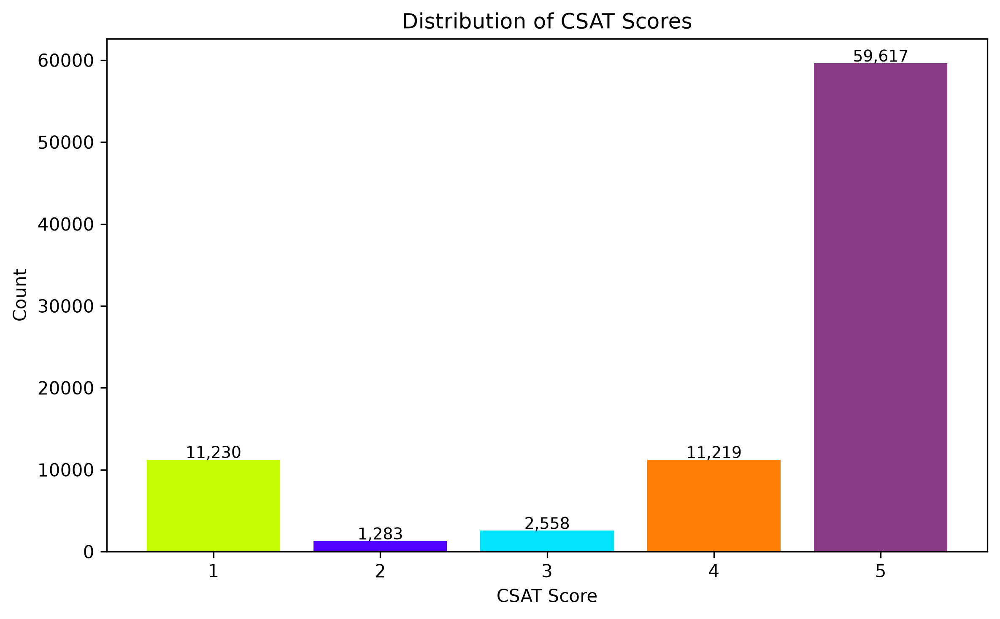
<br>
<b>CSAT Score Distribution</b>
</td>

<td align="center">
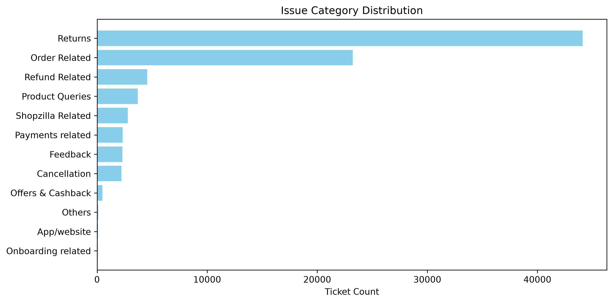
<br>
<b>Issue Category Distribution</b>
</td>
</tr>

<tr>
<td align="center">
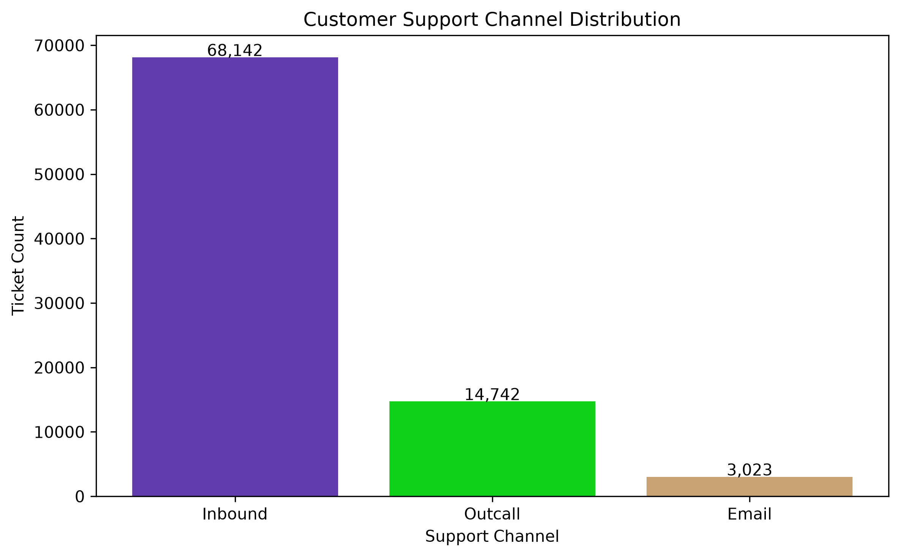
<br>
<b>Support Channel Distribution</b>
</td>

<td align="center">
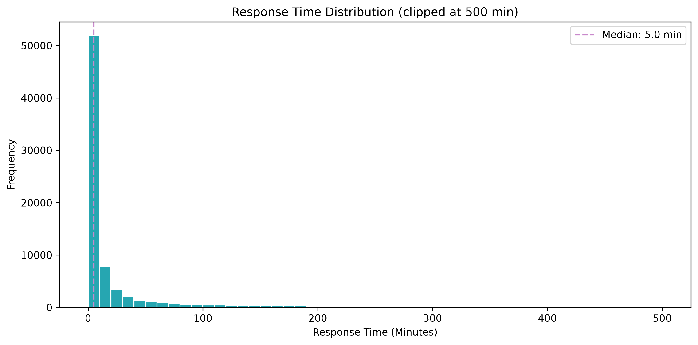
<br>
<b>Response Time Distribution</b>
</td>
</tr>
</table>

<table>
<tr>
<td align="center">
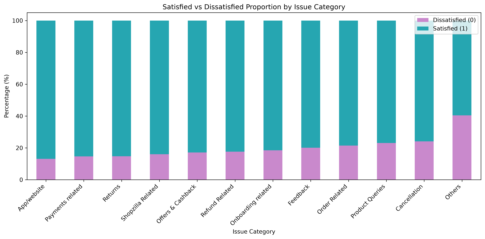
<br>
<b>Customer Satisfaction by Issue Category</b>
</td>
</tr>
</table>

<table>
<tr>
<td align="center">
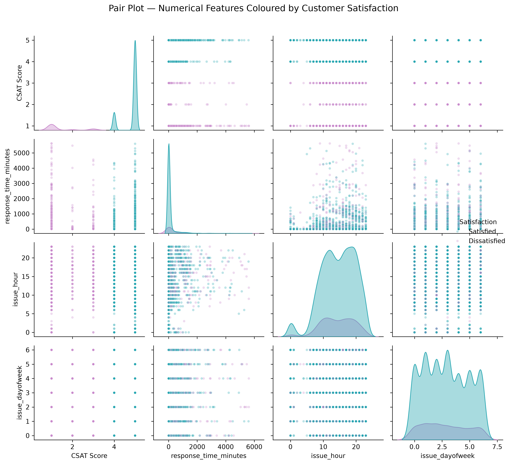
<br>
<b>Pair Plot of Numerical Features</b>
</td>
</tr>
</table>

<h2>Feature Analysis & Explainability</h2>

<table>
<tr>
<td align="center">
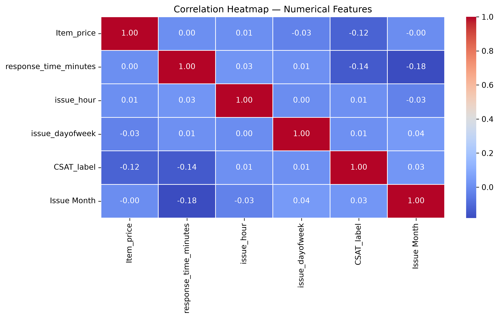
<br>
<b>Correlation Heatmap</b>
</td>

<td align="center">
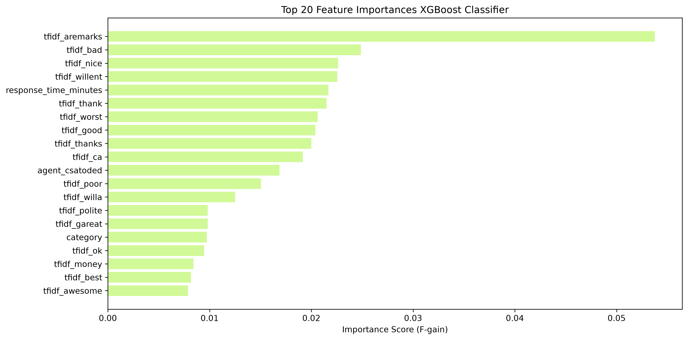
<br>
<b>XGBoost Feature Importance</b>
</td>
</tr>

<tr>
<td align="center">
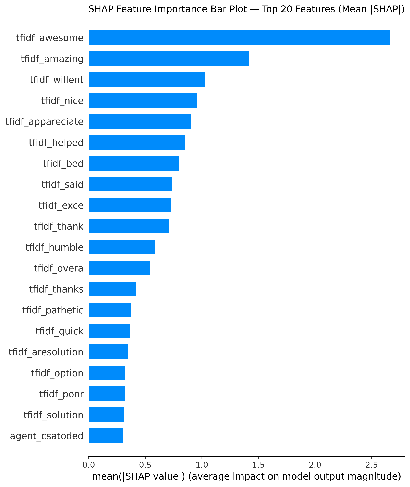
<br>
<b>SHAP Feature Importance</b>
</td>

<td align="center">
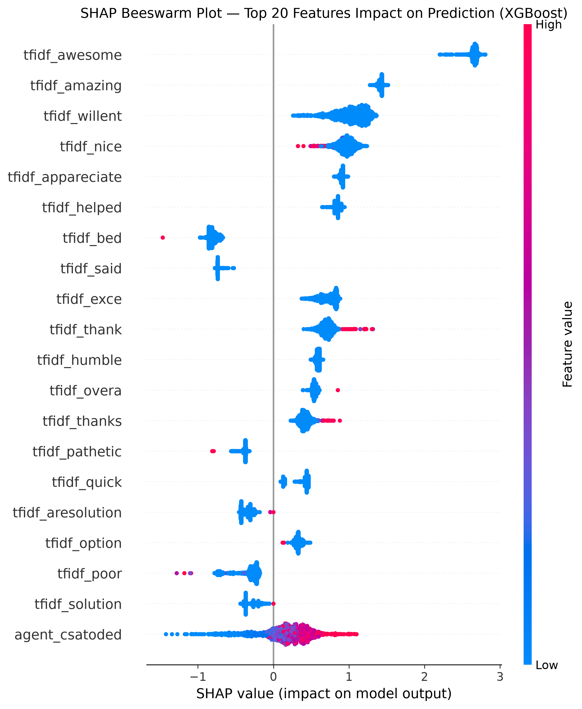
<br>
<b>SHAP Beeswarm Plot</b>
</td>
</tr>
</table>

<table>
<tr>
<td align="center">
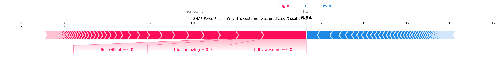
<br>
<b>SHAP Force Plot</b>
</td>
</tr>
</table>

<h2>Model Performance</h2>

<table>
<tr>
<td align="center">
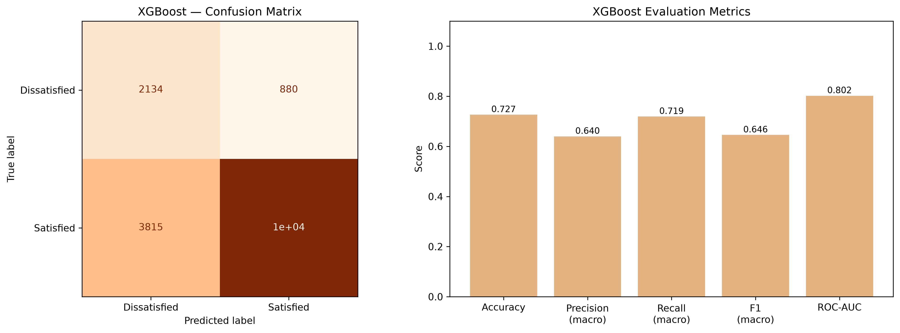
<br>
<b>XGBoost Confusion Matrix & Metrics</b>
</td>

<td align="center">
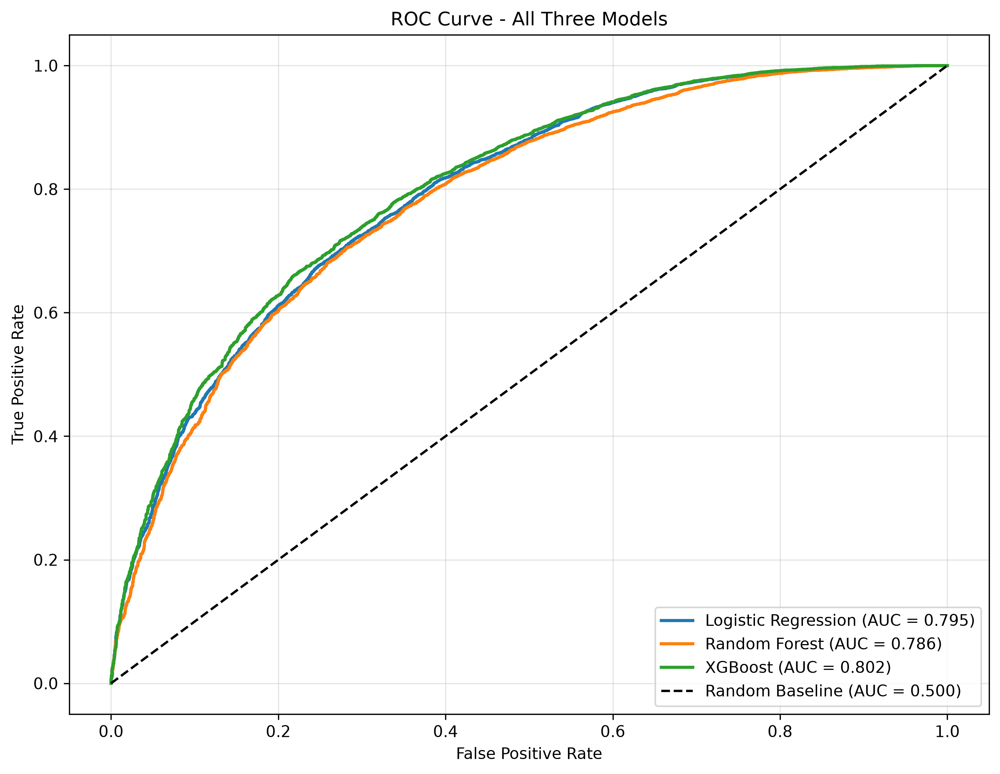
<br>
<b>ROC Curve</b>
</td>
</tr>

<tr>
<td align="center">
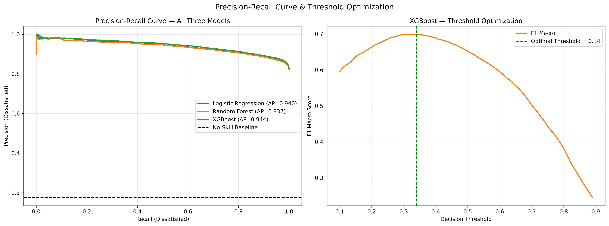
<br>
<b>Precision-Recall & Threshold Analysis</b>
</td>

<td align="center">
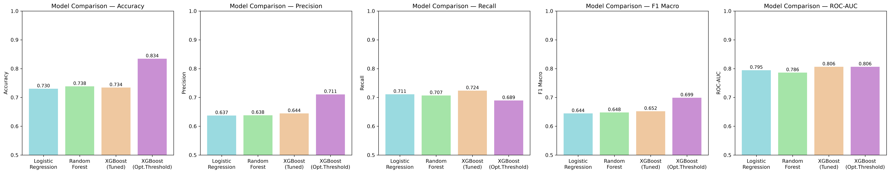
<br>
<b>Model Comparison</b>
</td>
</tr>
</table>

---

# Business Impact

## Practical Applications

* Customer Retention
* Ticket Prioritization
* Support Optimization
* Churn Reduction

---

## ROI Benefits

* Faster issue resolution
* Better customer experience
* Reduced support costs
* Increased customer lifetime value

---

# Challenges Faced

## Data Challenges

* Missing values
* Class imbalance
* High-dimensional text features

---

## Technical Challenges

* NLP preprocessing
* Sparse matrix handling
* Hyperparameter optimization

---

## Solutions

* Class weighting
* TF-IDF vectorization
* GridSearchCV tuning

---

# Future Improvements

## Model Enhancements

* LightGBM
* CatBoost
* Deep Learning Models

---

## NLP Improvements

* BERT
* RoBERTa
* Sentence Transformers

---

## Deployment Roadmap

* FastAPI
* Docker
* AWS Deployment
* Real-time Monitoring

---

# Installation Guide

```bash
git clone https://github.com/Mohit-1307/Flipkart-CSAT-Prediction.git

cd Flipkart-CSAT-Prediction

pip install -r requirements.txt
```

---

# Usage

```bash
jupyter notebook
```

Open:

```bash
flipkart_CSAT_prediction.ipynb
```

Run all cells sequentially.

---

# Project Structure

```text
Flipkart-CSAT-Prediction/
│
├── data/
│   └── Customer_support_data.csv
│
├── notebooks/
│   └── flipkart_CSAT_prediction.ipynb
│
├── models/
│   ├── best_xgboost_classifier.pkl
│   ├── tfidf_vectorizer.pkl
│   ├── standard_scaler.pkl
│   └── power_transformer.pkl
│
├── images/
│   ├── roc_curve.png
│   ├── confusion_matrix.png
│   └── feature_importance.png
│
├── requirements.txt
├── README.md
└── LICENSE
```

---

# Reproducibility

To reproduce results:

1. Clone repository.
2. Install dependencies.
3. Load dataset.
4. Execute notebook sequentially.
5. Train models.
6. Run GridSearchCV.
7. Compare results.
8. Save final model artifacts.

---

# Key Learnings

* End-to-End ML Pipeline Development
* NLP Feature Engineering
* Handling Imbalanced Data
* Ensemble Learning
* Hyperparameter Optimization
* Business-Oriented Model Evaluation
* Model Persistence & Reproducibility

---

## Author

**MOHIT SINGH RAJPUT — AI/ML Engineer**

[](https://linkedin.com/in/mohitsingh1307)
[](https://github.com/Mohit-1307)
[](https://www.kaggle.com/mohitsinghrajput1307)
[](https://leetcode.com/u/MOHIT_SINGH_RAJPUT/)
[](mailto:mohitsinghrajput1307@gmail.com)

---

# Acknowledgements

* Flipkart Customer Support Dataset
* Scikit-Learn Community
* XGBoost Contributors
* NLTK Developers
* Open Source Machine Learning Ecosystem

---

<div align="center">

*If this project was useful, a ⭐ on the repository is appreciated.*

</div>

---

# Disclaimer

Flipkart is a trademark of its respective owner. This project is created solely for educational and portfolio purposes and is not affiliated with or endorsed by Flipkart.